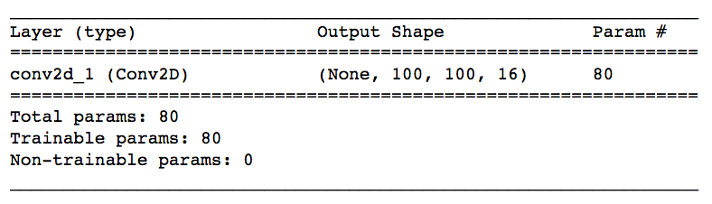
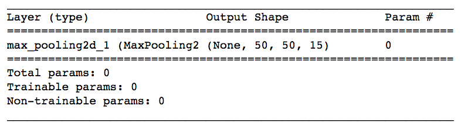
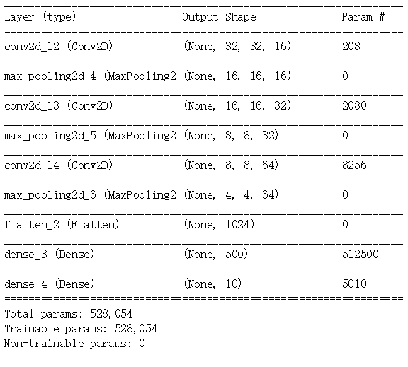

[Keras官方文档](https://keras-cn.readthedocs.io/en/latest/)

使用 Keras 构建神经网络。一般流程是首先加载数据，然后定义网络，最后训练网络。

## 全连接神经网络

要使用 Keras，需要知道以下几个核心概念。

### 序列模型

```python
from keras.models import Sequential
# Create the Sequential model
model = Sequential()
```

[keras.models.Sequential](https://keras.io/models/sequential/) 类是神经网络模型的封装容器。它会提供常见的函数，例如 `fit()`、`evaluate()` 和 `compile()`。


### layers

Keras 提供全连接层、最大池化层和激活层等。可以使用模型的 `add()` 函数添加层。

```python
from keras.models import Sequential
from keras.layers.core import Dense, Activation, Flatten

model = Sequential()

# 第一层 - 添加有128个节点的全连接层以及有32个节点的输入层
model.add(Dense(128, input_dim=32, activation='relu'))
# 第二层 - 添加10个节点的输出层
model.add(Dense(10, activation='softmax'))

# 查看模型架构
model.summary() 
```

Keras 将根据第一层自动推断后续所有层的形状。即只需为第一层设置输入维度。

上面的第一层 `model.add(Dense(input_dim=32))` 将维度设为 32（表示数据来自 32 维空间）。第二层级获取第一层级的输出，并将输出维度设为 128 个节点。将输出传递给下一层级并继续传下去，直到最后一个层级（即模型的输出）。可以看出输出维度是 10。


### 编译

构建好模型后，通过`compile`来对学习过程进行配置。`compile`接收三个参数：

* **优化器optimizer**：该参数可指定为已预定义的优化器名，如`rmsprop`、`adagrad`，或一个`Optimizer`类的对象，详情见[optimizers](https://keras-cn.readthedocs.io/en/latest/other/optimizers/)，下面是三个常用优化器：
  * SGD：随机梯度下降。它使用了以下参数：

    学习速率。

    动量（获取前几步的加权平均值，以便获得动量而不至于陷在局部最低点）。

    Nesterov 动量（当最接近解决方案时，它会减缓梯度）。

    ```python
    from keras.optimizers import SGD
    sgd = SGD(lr=0.01, decay=1e-6, momentum=0.9, nesterov=True)
    model.compile(loss='categorical_crossentropy', optimizer=sgd, metrics=['accuracy'])
    ```

  * Adam： (Adaptive Moment Estimation) 使用更复杂的指数衰减，不仅仅会考虑平均值（第一个动量），并且会考虑前几步的方差（第二个动量）。

  * RMSProp： (RMS 表示均方根误差）通过除以按指数衰减的平方梯度均值来减小学习速率。

* **损失函数loss**：该参数为模型试图最小化的目标函数，它可为预定义的损失函数名，如多分类问题`categorical_crossentropy`、二分类问题`binary_crossentropy` 、回归问题`mse`，也可以为一个损失函数。详情见[losses](https://keras-cn.readthedocs.io/en/latest/other/objectives/)

* **指标列表metrics**：指定评估模型用到的指标。对分类问题，一般设置为`metrics=['accuracy']`。指标可以是一个预定义指标的名字，也可以是一个用户定制的函数。指标函数应该返回单个张量，或一个完成`metric_name -> metric_value`映射的字典。请参考[性能评估](https://keras-cn.readthedocs.io/en/latest/getting_started/other/metrices.md)

```python
# For a binary classification problem
model.compile(optimizer='rmsprop',loss='binary_crossentropy',metrics=['accuracy'])

# For a multi-class classification problem
# 使用多类对数损失函数，需要对标签进行独热编码
model.compile(optimizer='rmsprop',loss='categorical_crossentropy',metrics=['accuracy'])

# For a mean squared error regression problem
model.compile(optimizer='rmsprop',loss='mse')
```


### 训练

Keras以Numpy数组作为输入数据和标签的数据类型。训练模型一般使用`fit`函数，该函数的详情见[这里](https://keras-cn.readthedocs.io/en/latest/models/sequential/)。

使用 fit 命令训练模型并，每 epoch 完成对整数据集的一次遍历。 verbose 参数可以指定显示训练过程的信息详细程度，定义为 0 表示不显示信息。如下例子中 batch_size 表示将数据分成的100批。

`model.fit(X, y, epochs=1000, batch_size=100, verbose=0)`


### 示例

从最简单的示例开始。构建一个简单的多层前向反馈神经网络以解决 XOR 问题。

可以发现解决有 4 个数据点的简单 XOR 问题就需要一个庞大的架构！并且理论上具有 2 个隐藏节点的 2 层网络就可以做到。

Keras [多层感知器](https://github.com/fchollet/keras/blob/master/examples/mnist_mlp.py) 网络示例和这个要构建模型类似。

```python
import numpy as np
from keras.utils import np_utils

X = np.array([[0,0],[0,1],[1,0],[1,1]]).astype('float32')
y = np.array([[0],[1],[1],[0]]).astype('float32')
# Convert labels to categorical one-hot encoding
y = np_utils.to_categorical(y)

from keras.models import Sequential
from keras.layers.core import Dense, Activation, Dropout

# Building the model and add required layers
xor = Sequential()
xor.add(Dense(16, input_dim=2, activation='tanh'))
model.add(Dropout(0.3))
xor.add(Dense(8, activation='relu'))
model.add(Dropout(0.3))
xor.add(Dense(2, activation='softmax'))
# xor.summary() # the model architecture

xor.compile(loss="categorical_crossentropy", optimizer="adam", metrics = ['accuracy'])

xor.fit(X, y, epochs=100, verbose=0)

# 评估模型
score = xor.evaluate(X, y)
print("\nAccuracy: ", score[-1])

# Checking the predictions
print("\nPredictions:")
print(xor.predict_proba(X))
```


## 卷积神经网络


### 卷积层

在 Keras 中创建卷积层：

```python
from keras.layers import Conv2D
Conv2D(filters, kernel_size, strides, padding, activation='relu', input_shape)
```

必须传递以下参数：

* `filters` - 过滤器数量。
* `kernel_size` - 指定卷积核的高和宽的数字。

可能还需要调整其他可选参数：

* `strides` - 卷积 stride。默认 `strides` 为 `1`。
* `padding` - 选项包括 `'valid'` 和 `'same'`。默认 `padding` 为 `'valid'`。`same` 表示在图片边缘填充0。
* `activation` - 通常为 `'relu'`。如果未指定任何值，则不应用任何激活函数。**建议**向网络中的每个卷积层添加一个 ReLU 激活函数。

* `input_shape` - 指定输入的高度、宽度和深度（按此顺序）的元组。

**注意**：只有卷积层是网络的第一层级（出现在输入层之后），才需要包含 `input_shape` 参数。

还可以设置很多其他元组参数，以便更改卷积层的行为。要详细了解这些参数，建议参阅官方[文档](https://keras-cn.readthedocs.io/en/latest/layers/convolutional_layer/)。


**示例：**

第一层：构建一个 CNN，输入层接收的是 200*200 像素（高 200、宽 200、深 1 的三维数组）的灰度图片。下一层级是卷积层，具有 16 个过滤器，每个宽和高分别为 2。在进行卷积操作时，过滤器每次跳转 2 个像素。不希望过滤器超出图片界限之外，即不用 0 填充图片。

 `Conv2D(filters=16, kernel_size=2, strides=2, activation='relu', input_shape=(200, 200, 1))`

第二层：新层级是 32 个过滤器，每个宽和高都是 3。在进行卷积操作时，过滤器每次移动 1 个像素。卷积层查看上一层级的所有区域，即不介意过滤器在进行卷积操作时是否超过上一层级的边缘。

 `Conv2D(filters=32, kernel_size=3, padding='same', activation='relu')`

第三层：有 64 个过滤器，每个的大小是 2*2，层级具有 ReLU 激活函数。层级中的其他参数使用默认值，因此卷积的 stride 为 1，padding 设为 'valid'。

 `Conv2D(64, (2,2), activation='relu')`


**在 Keras 中创建卷积层**

首先创建一个`序列`模型，使用 `.add()` 方法向该网络中添加层级。

```python
from keras.models import Sequential
from keras.layers import Conv2D

model = Sequential()
model.add(Conv2D(filters=16, kernel_size=2, strides=2, padding='valid', 
                 activation='relu', input_shape=(200, 200, 1)))
model.summary()
```

查看卷积层的维度变化：



输出内容中的 `Param #` 的值就是卷积层中的**参数数量**。在上图中，卷积层具有 `80` 个参数。

输出内容中的 `Output Shape` 的值就是卷积层的**形状**。在上图中，`None` 对应的是批次大小，卷积层的高度为 `100`，宽度为 `100`，深度为 `16`。


### 最大池化层

在 Keras 中创建最大池化层：

```python
from keras.layers import MaxPooling2D
MaxPooling2D(pool_size, strides, padding)
```

必须传递以下参数：

* `pool_size` - 指定池化窗口高度和宽度的数字。

可能还需要调整其他可选参数：

* `strides` - 垂直和水平 stride。`strides` 默认为 `pool_size`。
* `padding` - 选项包括 `'valid'` 和 `'same'`。`padding` 默认为 `'valid'`。

详细内容建议阅读官方[文档](https://keras.io/layers/pooling/#maxpooling2d)。

**示例**

在卷积层后面添加最大池化层，来降低卷积层的维度。假设卷积层的大小是 `(100, 100, 15)`，最大池化层的大小为 `(50, 50, 15)`。要实现这一点，在最大池化层中使用 2x2 窗口，stride 设为 2。

 `MaxPooling2D(pool_size=2, strides=2)`


**在 Keras 中创建最大池化层**

```python
from keras.models import Sequential
from keras.layers import MaxPooling2D

model = Sequential()
model.add(MaxPooling2D(pool_size=2, strides=2, input_shape=(100, 100, 15)))
model.summary()
```

查看最大池化层的维度变化：




### 构建CNN模型

CNN模型的设计目标是获取图片输入，然后使其深度逐渐大于宽和高。

卷积层将用于增加穿过卷积层的数组的深度，最大池化层用于减小宽和高。


Convolution2D 中使 stride=1 且 padding=`same`，会使卷积层的宽和高与上一层级相同。随着卷积层的增加，过滤器数量也在增加。

MaxPooling2D 中使 pool_size=1 且 stride=2，将使空间维度变为上一层级的一半。

这种层级序列可以发现图片中包含的空间规律，逐渐获取空间数据，将数组转换为包含图片内容的形式。经过一系列卷积层和最大池化层，最后会丢失所有的空间信息，即图片中的对象没有位置关系。

这个时候就可以扁平化该数组，并将其提供给全连接层，判断图片中包含什么对象。

```python
from keras.models import Sequential
from keras.layers import Conv2D, MaxPooling2D, Flatten, Dense

model = Sequential()
model.add(Conv2D(filters=16, kernel_size=2, padding='same', activation='relu',
                 input_shape=(32, 32, 3)))
model.add(MaxPooling2D(pool_size=2))
model.add(Conv2D(filters=32, kernel_size=2, padding='same', activation='relu'))
model.add(MaxPooling2D(pool_size=2))
model.add(Conv2D(filters=64, kernel_size=2, padding='same', activation='relu'))
model.add(MaxPooling2D(pool_size=2))
model.add(Flatten())
model.add(Dense(500, activation='relu'))
model.add(Dense(10, activation='softmax'))
model.summary()
```

查看卷积神经网络的维度变化：



该网络以三个卷积层（后面跟着最大池化层）序列开始。前 6 个层级旨在将输入图片像素数组转换为**所有空间信息都丢失、仅保留图片内容信息**的数组 。然后在 CNN 的第七个层级将该数组扁平化为向量。后面跟着两个全连接层，旨在进一步说明图片中的内容。最后一层针对数据集中的每个类别都有一个条目，并具有一个 softmax 激活函数，使其返回概率。

**注意事项**

* 向 CNN 中的 `Conv2D` 层添加 ReLU 激活函数，全连接层也应该具有 ReLU 激活函数。
* 在构建分类网络时，网络中的最后层级应该是具有 softmax 激活函数的 全连接层。最后层级的节点数量应该等于数据集中的类别总数。
* 参阅 [Andrej Karpathy 的 tumblr](https://lossfunctions.tumblr.com/)（来自外网），其中包含了用户提交的损失函数，对应的是本身有问题的模型。损失函数在训练期间应该是减小的，但是这些图表显示的却是非常不同的行为。

