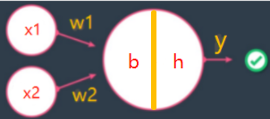
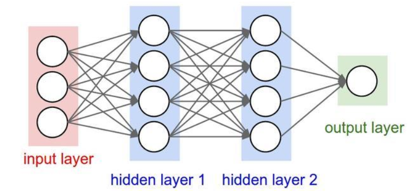
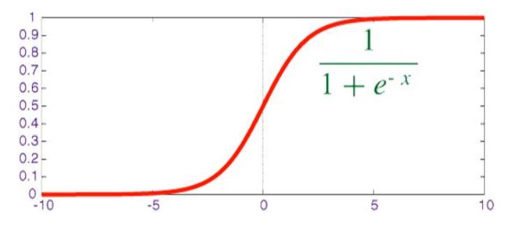
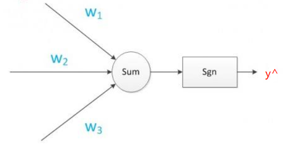
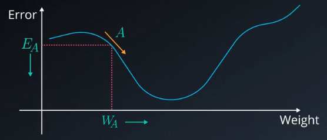
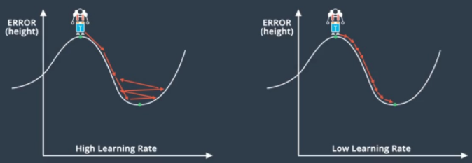
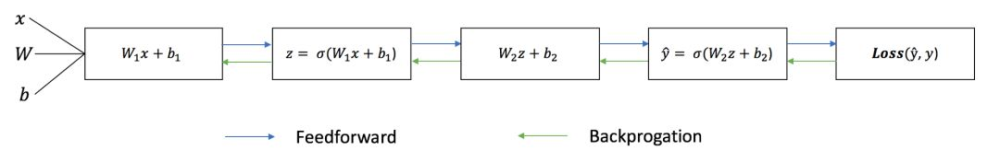
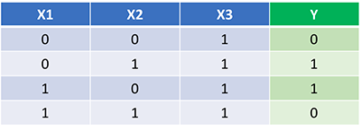
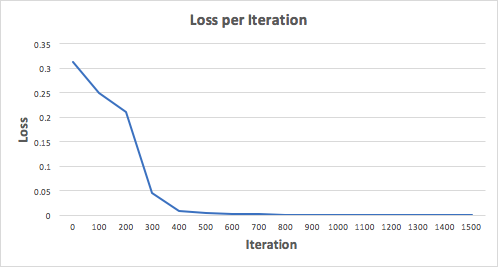
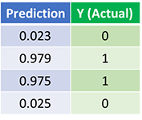

**神经网络简单理解就是建立输入向量和输出向量的一种映射关系，即根据输入作出决策的模型。**


## 单个神经元（感知器）

最简单的神经网络：输入数据（x1，x2，x3...），处理信息，然后给出一个结果作为输出（output）。 



表达式：$y = h(x_1w_1 + x_2w_2 + b) = h(\sum_i x_iw_i +b) $

* w：权重

* b：偏移量
* h：激活函数（假设为单位阶跃函数） 

$$h(x)=\begin{cases} 1, & x \geq 0 \\ 0, & x < 0 \end{cases}$$ 


### AND感知器

输入：[(0, 0), (0, 1), (1, 0), (1, 1)]

输出：[0, 0, 0, 1]

根据上面的表达式，要得到输入和输出的映射，可以令参数值如下：

* w1 = 1.0
* w2 = 1.0
* b = -1.5


### OR 感知器

输入：[(0, 0), (0, 1), (1, 0), (1, 1)]

输出：[0, 1, 1, 1]

根据上面的表达式，要得到输入和输出的映射，可以令参数值如下：

* w1 = 1.0
* w2 = 1.0
* b = -0.5


上面的两个感知器也可以看做是分类问题，类似于判断邮件是不是垃圾邮件等，这两个感知器在判断输出结果是不是 1。

神经网络的强大，在于不用手动设置这些参数，**其具有从输入样本中自己学习的能力**。


## 神经网络模型

下图是一个完整的神经网络，一个神经网络包含了以下元素：

* 一个输入层（input layer）， $x$
* 任意数量的隐藏层（hidden layers）
* 一个输出层（output layer）， $\hat y$
* 每个层与层之间都有一组权重（weights） $W$ 与偏移量（biases） $b$
* 除了输入层外，每一层隐藏层与输出层都会有一个对应的激活函数 $\sigma$。



如下是上面三层神经网络的表达式：

$output_1 = \sigma (W_1 X + b_1)$

$output_2 = \sigma (W_2 output_1 + b_2)$

$\hat y = \sigma (W_3 output_2 + b_3)$ 

注意：权重矩阵的维度为 $(n_{output}, n_{input}) $，输入x为列元素 (n,1) 。


权重与偏移量决定了预测值 $\hat y$。通过微调权重与偏移量、使得预测值越来越准确的过程，称为**训练神经网络**。 


### 激活函数

作为一个分类模型，预测结果往往不是”是”或“否“这样的离散形式，而是在0到1的范围内的连续数字，称之为概率。比如垃圾邮件检测模型，离散预测直接得出是否是垃圾邮件，连续预测得出是垃圾邮件的概率。从离散预测变成连续预测的方法是将 $sigmoid$ 作为激活函数。

**sigmoid**： $\sigma(x) = \dfrac{1}{1+e^{-x}}$




### 误差函数

误差函数表示当前结果与标签之间的差别是多少，训练模型的目的就是尽可能地减小误差函数。

这里令误差函数为差平方：$E=\dfrac{1}{2}(y−\hat y )^2$

对差值取平方，就可以无需考虑符号（偏差方向）问题。 


### 梯度下降法

在梯度下降法中，减小误差函数一般采取非常小的步长，这一步长是用导数计算得到的，误差函数需要是可微分的，所以误差函数必须是连续型函数，这样的话，当输入发生轻微变化，误差都会跟着变化。

简单起见，这里计算单个神经元的梯度：



该神经网络的表达式：

* $z(w,b) = W x+b$
* $\hat y(w,b) = \sigma(z) = \dfrac{1}{1+e^{-z}}$
* $E(w,b)=\dfrac{1}{2}(y−\hat y )^2$


下面是梯度下降算法的步骤：

1、误差函数相对于 $z$ 的导数：

$$\dfrac{\partial E}{\partial z} = \dfrac{\partial E}{\partial \hat y} \cdot \dfrac{\partial \hat y}{\partial z} = -(y-\hat y) \cdot \sigma'(z)$$

$\sigma'(z) = \sigma(z) \cdot (1-\sigma(z))$

2、梯度是误差函数相对于 $w_i$ 和 $b$ 的偏导数：

$$\nabla w_i = \dfrac{\partial E}{\partial w_i} = \dfrac{\partial E}{\partial z} \cdot \dfrac{\partial z}{\partial w_i} = -(y-\hat y) \sigma'(z) x_i$$

$$\nabla b= \dfrac{\partial E}{\partial b} = \dfrac{\partial E}{\partial z} \cdot \dfrac{\partial z}{\partial b} = -(y-\hat y) \sigma'(z)$$

3、因为更新的步长为梯度的相反数，所以步长为：

$$\Delta w_i = - \alpha \dfrac{\partial E}{\partial w_i} = \alpha (y-\hat y) \sigma'(z) x_i$$

$$\Delta b = - \alpha \dfrac{\partial E}{\partial b} = \alpha (y-\hat y) \sigma'(z)$$

4、所以更新权重可以表示为：

$$w_i = w_i+ \Delta w_i$$

$$b= b+ \Delta b$$


为什么通过上面的方式更新参数就可以减小误差函数的值？

误差函数是关于权重的函数，假设初始权重是 $w_A$，误差是 E。E 的梯度是 E 相对于 $w_A$ 的偏导数。如果有多个权重，则是这多个权重偏导数的矢量和。

假设在下降过程中，这个梯度就是误差函数减小最快的方向，梯度为负数。希望误差函数减小，则需要增大权重 $w_A$，所以权重变化量为梯度的相反数，即为正数。 

同理，在上升过程中，梯度为正数，希望减小误差函数，则需要较小权重，则权重变化量为梯度的相反数，即为负数。



### 学习率

学习率 $\alpha$ 是个很小的数，通常初始化为0.001。

如果学习速率很大，则对应的就是很大的步长，容易错过最低值，然后使得模型混乱，不能收敛。

如果学习速率很小，使得模型训练很慢，且容易到达局部最低值。




## 模型的训练方式

当有好几十个特征共同影响结果的时候，自然就会涉及权重分配的问题。

**（1）初始化权重计算**
第一步就是给这些特征加一个权重值，但是，最开始根本不知道这些权重值是多少？先给它们随机赋值，最终计算出来的结果肯定是不准确的。

**（2）损失函数** 
因为现在模型的输出值和实际值差距比较大，于是引入一个评估“不准确”程度的衡量角色，也就是损失（loss）函数，它是衡量模型估算值和真实值差距的标准，损失函数越小，则模型的估算值和真实值的差距越小，而训练模型的目的，就是降低这个损失函数。

**（3）模型调整** 
通过**梯度下降**和**反向传播**，计算出朝着降低损失函数的方向**调整权重参数**。

**（4）循环迭代**
调整了模型的权重之后，就可以又重新取一批新的样本数据，重复前面的(2)、(3)步骤，经过几十万次甚至更多的训练次数，最终模型的输出值逼近了真实值结果，就得到了最优模型。


每个迭代的训练过程都包含了以下步骤：

* 计算估算值 $\hat y$，称为前向传播；
* 更新权重与偏移量，称为反向传播

以下流程图展示了前向传播与反向传播的全过程：




## 实际问题

知道神经网络的上述内容，就可以来解决一些实际问题 。



上图是一个三维向量x到一维向量y的映射。神经网络理论上应该能够学习一组理想的权重来表达这个映射函数。

把神经网络训练1500个迭代，可以得到下面的训练图表，误差随着训练的迭代数增加而呈单调递减的趋势，最终会收敛在某个最小值。



经过1500个迭代训练后，成功地训练了神经网络并且使预测值收敛于真实值附近，神经网络的预测结果：



这里预测值与真实值之间有一定的差距，这是符合期望的。因为这样能避免过拟合，可以使神经网络能更好地泛化于一些没见过的新数据样本。


## 扩展内容

上面的例子只有一个样本数据，一个输出，一层网络。可以通过深度学习框架可以实现非常复杂的神经网络。

比如使用keras实现一个神经网络：

```python
from keras.models import Sequential
from keras.layers.core import Dense, Activation, Flatten

#创建序列模型
model = Sequential()

#第一层 - 添加有128个节点的全连接层以及有32个节点的输入层
model.add(Dense(128, input_dim=32, activation='softmax'))
#第二层 - 添加10个节点的全连接层
model.add(Dense(10, activation='sigmoid'))
```


现在已经知道了一个完整的神经网络，但对于入门神经网络与深度学习领域，还有许多需要去研究的细节。

* 激活函数梯度消失的问题
* 初始化权重
* 使用卷积层来处理图像识别任务
* 过拟合和欠拟合
* ……


